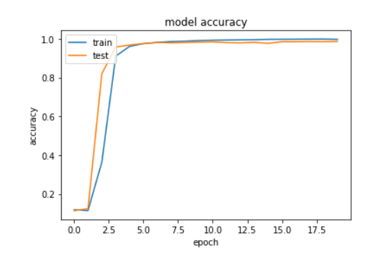
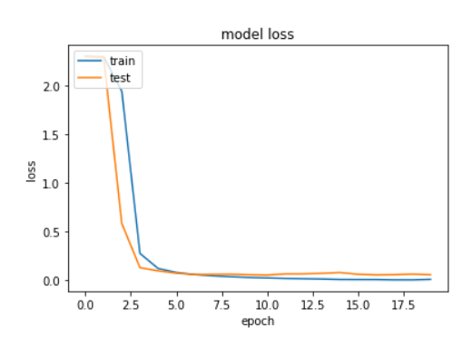
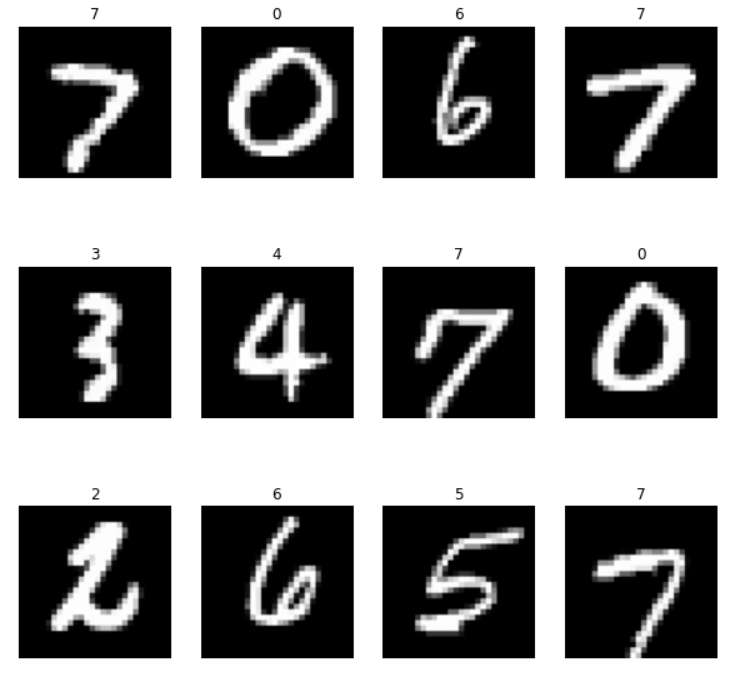

# Implementation-of-VGG16-Architecture

## Overview

This is a keras implementation of the VGG16 model based on keras. VGG16 is a type of CNN (Convolutional Neural Network). It is an object detection and classification algorithm that is able to classify 1000 images into 1000 different categories. It is one of the most popular algorithms for image classification.

## Purpose

The purpose of this model is to classify handwritten digits. Using the keras library and MNIST Handwritten digits dataset, the VGG16 model recognises the image given as input as one of the 10 digits.

## Source

The project was implemented using the Modified National Institute of Standards and Technology (MNIST) handwritten digit dataset. 

This project was implemented on the Kaggle platform. Here's the [link](https://www.kaggle.com/code/jatinmotwani12/implementation-of-vgg16-v2) for the notebook.

## Training Statistics

Model Training Accuracy = 0.99 (Approximately)

Model Training Loss     = 0.008 (Approximately)

## Output

## Team

The project was made possible by the contributions of the members of the RJP Team consisting of:

- [Rishav Verma](https://github.com/bunnyrishav-21)
- [Jatin Motwani](https://github.com/Jatin-1956)
- [Rampalli Pranav](https://www.linkedin.com/in/pranav-rampalli-610a3821b/)

## References

- [Dataset Used](https://www.kaggle.com/competitions/digit-recognizer)
- [Kaggle Notebook](https://www.kaggle.com/code/jatinmotwani12/implementation-of-vgg16-v2)
- [deeplizard YouTube channel](https://www.youtube.com/c/deeplizard)
- [Medium Article](https://medium.com/mlearning-ai/an-overview-of-vgg16-and-nin-models-96e4bf398484)
- [IBM CNN Article](https://www.ibm.com/cloud/learn/convolutional-neural-networks)
- [Article on Trasnfer Learning](https://www.learndatasci.com/tutorials/hands-on-transfer-learning-keras/)
